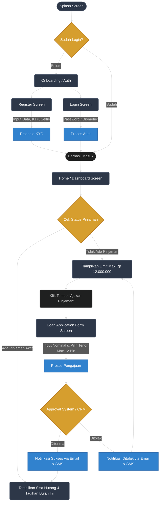

# Solution-Analyst
Test Solution Analyst

# Nomor 1
[![](https://mermaid.ink/img/pako:eNqNVX9v4jgQ_SqWpT21EtDlV6BodVIIba8q6Yaaveou7B8mMcFHsJHj0GVLv_uN45Rzd6vVRSLEkzd5M2-ek2ecyJThEV7l8ilZU6XRfLwQCI6iXGaK7tYoyDkTGsWRYgVcUM2lQHPO1FcLNEfox6Fc8pwhf7dbLMQDo4lG94DdM3SBrvNS61MCE-lC_EBCWFIqrg8ovkozhn47BRySR_86hh_cDCb3QBLkskxXOVWGwn8kBuDA_ZvYj27RDdXsiR5qiBP5RTUhT5QsmNrzhBUoHtNkAzCoyUZcEhJ_ASDU5Jd6_YpwAFMSTyUV6LPiGRdWvJ9R9yS-l5qvePIe4t0SWVHQjI2V3AB9fLU3MxqXhemzOIhkraSQpVtqOIvP6ixk00DDO7raUMh5oMsl1-Hs_BeU8zVXaQQeMVP6BvMUNEe3QjO4bap2ye7-CmLWhDMo8ydTp86AMlJ8746VXMeBhBmOqdhwkTl3InrYQltx_f8_BjehmqK4OoOFtFSm2R-8OhnHZw-TcUhMLbLQmWJkNj13EAFN1iw-uxXNkG2lOthAZeuUFy6SdOOzz8t_GJi9ZgOU8Rnpgqg3AXlHzw8f0IMsNbQK-0I-2WDoo0_N5u_HP-bziEDqfEpQu9U9Gk9bhHG-gYCvbcC_qdfk7XpKHCbXCxUdOnlgVrKSnVsksDVbQB-Vy5wXa1RZtvLUEXxTlzizmAAmXW7tHoVNcbWlPL8gITmCi98i5-D5DNwJ7wQl92CWR6k25k1zhKE7RdZuf-OluidiZbEW2tCCo7t5BNRTeLEIaORonHbqocIS6Ng2MGEJL-Bhls7FTHixLFXBjK0uIiYSyhUFXO00p7bKS6-zfa3JyDwZ_yeds_StkrVlXHHdkH3G8csulzStWyIsX3EGtXZxA2eKp3ikVckaeMsUaAxL_GyyF1ivofAFHsFlStVmgRfiBXJ2VPwt5fY1TckyW-PRiuYFrMpdCrtnwikIvD1FFUyQqUCWQuPRsDesHoJHz_gbHnW8Vrvf6XYGHa_tdS-HXgMfAHTZGvYvvUG_PWgPBr3eSwN_r0jbrY-ddrc_6Pf63vDS87xeA8N2AeVC-4mpvjQv_wJ_o_vf?type=png)](https://mermaid.ai/live/edit#pako:eNqNVX9v4jgQ_SqWpT21EtDlV6BodVIIba8q6Yaaveou7B8mMcFHsJHj0GVLv_uN45Rzd6vVRSLEkzd5M2-ek2ecyJThEV7l8ilZU6XRfLwQCI6iXGaK7tYoyDkTGsWRYgVcUM2lQHPO1FcLNEfox6Fc8pwhf7dbLMQDo4lG94DdM3SBrvNS61MCE-lC_EBCWFIqrg8ovkozhn47BRySR_86hh_cDCb3QBLkskxXOVWGwn8kBuDA_ZvYj27RDdXsiR5qiBP5RTUhT5QsmNrzhBUoHtNkAzCoyUZcEhJ_ASDU5Jd6_YpwAFMSTyUV6LPiGRdWvJ9R9yS-l5qvePIe4t0SWVHQjI2V3AB9fLU3MxqXhemzOIhkraSQpVtqOIvP6ixk00DDO7raUMh5oMsl1-Hs_BeU8zVXaQQeMVP6BvMUNEe3QjO4bap2ye7-CmLWhDMo8ydTp86AMlJ8746VXMeBhBmOqdhwkTl3InrYQltx_f8_BjehmqK4OoOFtFSm2R-8OhnHZw-TcUhMLbLQmWJkNj13EAFN1iw-uxXNkG2lOthAZeuUFy6SdOOzz8t_GJi9ZgOU8Rnpgqg3AXlHzw8f0IMsNbQK-0I-2WDoo0_N5u_HP-bziEDqfEpQu9U9Gk9bhHG-gYCvbcC_qdfk7XpKHCbXCxUdOnlgVrKSnVsksDVbQB-Vy5wXa1RZtvLUEXxTlzizmAAmXW7tHoVNcbWlPL8gITmCi98i5-D5DNwJ7wQl92CWR6k25k1zhKE7RdZuf-OluidiZbEW2tCCo7t5BNRTeLEIaORonHbqocIS6Ng2MGEJL-Bhls7FTHixLFXBjK0uIiYSyhUFXO00p7bKS6-zfa3JyDwZ_yeds_StkrVlXHHdkH3G8csulzStWyIsX3EGtXZxA2eKp3ikVckaeMsUaAxL_GyyF1ivofAFHsFlStVmgRfiBXJ2VPwt5fY1TckyW-PRiuYFrMpdCrtnwikIvD1FFUyQqUCWQuPRsDesHoJHz_gbHnW8Vrvf6XYGHa_tdS-HXgMfAHTZGvYvvUG_PWgPBr3eSwN_r0jbrY-ddrc_6Pf63vDS87xeA8N2AeVC-4mpvjQv_wJ_o_vf)

### Justifikasi Teknis & Komponen Arsitektur

Arsitektur ini dirancang menggunakan pendekatan **Cloud-Native Microservices** dan **Event-Driven Architecture** untuk memastikan sistem pinjaman *online* beroperasi dengan aman, responsif, dan dapat diskalakan (*scalable*).

**1. Presentation & Security Tier**
* **Mobile App:** Menggunakan React Native / Flutter untuk efisiensi *cross-platform* (Android & iOS), serta memudahkan akses ke *native hardware* (Sensor Biometrik & Kamera) untuk kebutuhan otentikasi dan registrasi.
* **WAF & API Gateway:** Web Application Firewall melindungi sistem dari ancaman siber. API Gateway bertindak sebagai pintu masuk tunggal yang mengatur *routing*, *rate limiting*, dan validasi otentikasi sebelum permintaan diteruskan ke *backend*.

**2. Backend Microservices**
Fungsi aplikasi dipecah menjadi layanan independen agar kegagalan satu sistem tidak mematikan sistem lainnya:
* **User & Auth Service:** Mengurus siklus hidup pendaftaran pengguna, menyimpan data KTP, dan memproses *login*.
* **Loan Origination Service:** Mesin utama (*core engine*) yang menjalankan aturan bisnis. Layanan ini memvalidasi limit pinjaman maksimal Rp 12.000.000, tenor maksimal 1 tahun, dan memblokir pengajuan jika pengguna masih memiliki pinjaman aktif.
* **Notification Service:** Mengirimkan *update* status pengajuan via Email dan SMS.

**3. Asynchronous Processing (Message Broker)**
* Komunikasi ke layanan notifikasi dan pihak ketiga menggunakan **Message Broker** (seperti Kafka atau RabbitMQ). Saat pengajuan pinjaman masuk, *Loan Service* tidak langsung memanggil API notifikasi, melainkan melempar antrean pesan ke *Message Broker*. Ini memastikan aplikasi di sisi pengguna tidak *freeze* atau *loading* lama saat menunggu proses pihak ketiga selesai.

**4. External Integrations (Third-Party)**
* **e-KYC & Digital Signature:** Sistem diintegrasikan dengan penyedia identitas digital terverifikasi seperti Privy. Layanan ini memastikan validitas e-KTP dan memungkinkan penggunaan *electronic signature* secara aman dan sah di mata hukum untuk penandatanganan dokumen kontrak pinjaman.
* **CRM & Approval Engine:** Memanfaatkan platform CRM level *enterprise* seperti Salesforce untuk manajemen *back-office*. Eksekusi penentuan kelayakan kredit (*credit scoring*) dan alur persetujuan (*approval process*) diotomatisasi menggunakan *automation flows* dan *Apex code* secara *seamless* di latar belakang.
* **Payment Gateway:** Memfasilitasi proses pencairan dana secara *real-time* ke rekening pengguna setelah pinjaman disetujui.

**5. Data & Storage Tier**
* **RDBMS (PostgreSQL):** Menyimpan data transaksional terstruktur yang membutuhkan konsistensi tinggi (ACID *Compliance*), seperti data sisa hutang dan riwayat tagihan bulanan.
* **In-Memory Cache (Redis):** Menyimpan *session token* untuk mempercepat respons otentikasi pengguna.
* **Object Storage (AWS S3 / GCS):** Media penyimpanan khusus untuk dokumen biner berukuran besar (foto *selfie* dan gambar KTP). Menyimpan *file* di S3 dan hanya menyimpan tautan URL-nya di PostgreSQL menjaga performa *database* utama tetap cepat dan ringan.

# Nomor 2

[](https://mermaid.ai/live/edit#pako:eNqVVGtv2jAU_SuWpe1TqEJ45xsqYaLlJR7VNCFFhtwmLo6d-aGto_z32aS0wOimWUr8uPdc2-f43h3eiARwiEH2KEklyVcc2fbpE5oBI5oKrjJaqHJ1OY9mc_TyUqmIHRpOuuM5CtEK58BT8mS2hK9w6VjaXh0H4_miOxyOovHi6J9TRrcUaZLS7B31tvWCrBko9Bn1KbDkbPNdOXHNGJogo0DGtp_e28BTSXMin9E9PB9juqa0pDxFj4axmJMc0B8myAllNsCS0-8GrmCLTHCIucnXIP_mt9VFbM-QQmykC9ijiuYF4SihaF67AlDAHin8H6YgSv0QMokzorJ361oIBhZGVbymIgfrvImBOy4TG3ZSKIqOhi1iIqX8NHhCNGhq2dlIsMMkJro07k_VKZW9VIEJwksVPpCn7-TpCwk05U4etAW0tDZ1dgLYWB4YIrkwXFvAiGzVYWVWoGpw4_u--04h1Ppp4ELGueA6U6eganCNb020cW7ReDkK0TQa9wbjLx7qTqezyUPU89AsuotuF27UvV0MHiIPTbuDXjzp96-yRYqC0RO2zoymSD6m8iwvLhml3J6UMZta-iqxR8avETu0NnXJ0oGfWIF9t3wD7g1Lo-1rWRtm_1uofP1YijgxDnFnckayy6w9XhhZp_gwWOEF4Wlq4U-WbAuAvBD_1mI5dkSXdHto2F1ER8weeziVNMGhlgY8W0CkTVg7xQfaVlhnkNt0dMUlIXLrcA5jk-ibEPkRJoVJMxw-EqbsrNTmteq9rUrgCchbd2sc1jr-IQgOd_gnDqvN4Caot1p-0Aqa7Ua7UfPwMw4r1Ub9pt3pdJq1oOoHzaDe3nv412Hj6o3faLSanUY1qPntdlAPPAwJ1UKOyrp7KL_73zdLsIo)

### Justifikasi Desain Screen Flow & ERD

**1. Analisis Alur Layar (Screen Flow)**
* **Autentikasi & e-KYC:** Mengakomodasi kebutuhan registrasi (dengan *upload* foto dan KTP) dan opsi *login* biometrik. Proses verifikasi identitas dirancang untuk berintegrasi dengan penyedia layanan pihak ketiga (seperti Privy) guna memvalidasi data demografi dan memfasilitasi tanda tangan elektronik secara aman.
* **Pencegahan Risiko (Dashboard Logic):** Terdapat blok validasi khusus pada *Dashboard* yang mengunci tombol "Ajukan Pinjaman" jika sistem mendeteksi pengguna memiliki pinjaman aktif (`status = ACTIVE`). Ini merupakan implementasi langsung dari aturan bisnis utama untuk mencegah gagal bayar.
* **Otomatisasi Keputusan:** Node *Approval System* dirancang agar mudah dihubungkan dengan *backend automation*. Misalnya, memanfaatkan *flows* atau *Apex code* pada platform CRM (seperti Salesforce) untuk menjalankan *credit scoring* otomatis, yang kemudian memicu *Notification Service*.

**2. Analisis Struktur Data (ERD)**
Struktur data difokuskan pada integritas transaksional dan performa *database*:
* **Tabel `USERS`:** Menyimpan profil dan preferensi keamanan. Mengikuti *best practice*, *file* berukuran besar seperti KTP dan *selfie* tidak disimpan dalam bentuk `BLOB` di *database* relasional, melainkan dialihkan ke *Object Storage* (seperti S3), sedangkan *database* hanya menyimpan URL-nya.
* **Tabel `LOANS`:** Bertindak sebagai *header* transaksi peminjaman. Terdapat validasi pada *level* struktur untuk memastikan nilai nominal (`amount`) maksimal **Rp 12.000.000** dan `tenor_months` maksimal **12 bulan** sesuai prasyarat bisnis.
* **Tabel `INSTALLMENTS`:** Bertindak sebagai *child table* dari `LOANS` yang otomatis terbentuk (berdasarkan perhitungan tenor) ketika status pinjaman disetujui, mencatat tagihan spesifik untuk mempermudah visibilitas hutang pengguna.
